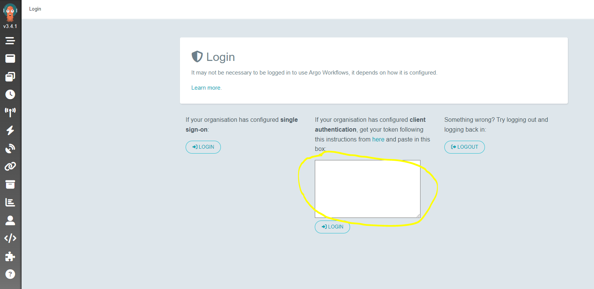
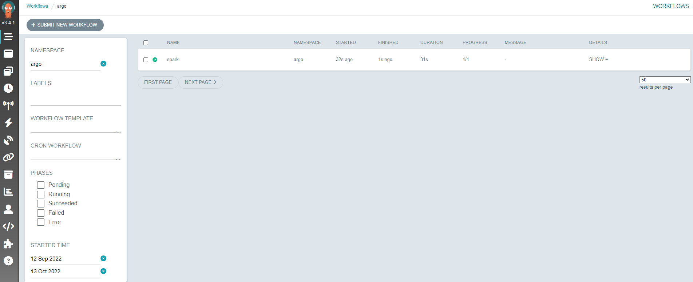
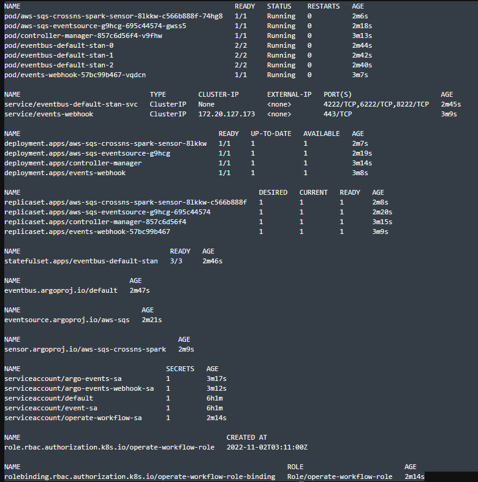
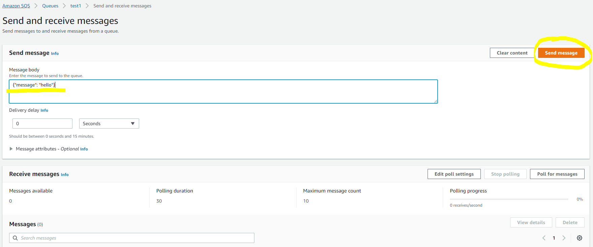

# Argo Workflows on EKS
Argo Workflows is an open source container-native workflow engine for orchestrating parallel jobs on Kubernetes. It is implemented as a Kubernetes CRD (Custom Resource Definition). As a result, Argo workflows can be managed using kubectl and natively integrates with other Kubernetes services such as volumes, secrets, and RBAC.

The example demonstrates how to use Argo Workflows to assign jobs to Amazon EKS in three ways.
1. Use Argo Workflows to create a spark job.
2. Use Argo Workflows to create a spark job through spark operator.
3. Trigger Argo Workflows to create a spark job based on Amazon SQS message insert event by using [Argo Events](https://argoproj.github.io/argo-events/).


[Code repo](https://github.com/awslabs/data-on-eks/tree/main/schedulers/argo-workflow) for this example.

## Prerequisites:

Ensure that you have the following tools installed locally:

1. [aws cli](https://docs.aws.amazon.com/cli/latest/userguide/install-cliv2.html)
2. [kubectl](https://Kubernetes.io/docs/tasks/tools/)
3. [terraform](https://learn.hashicorp.com/tutorials/terraform/install-cli)


## Deploy

To provision this example:

```bash
git clone https://github.com/awslabs/data-on-eks.git
cd data-on-eks/schedulers/argo-workflow
terraform init
terraform apply -var region=<aws_region> #defaults to us-west-2
```

Enter `yes` at command prompt to apply

The following components are provisioned in your environment:
- A sample VPC, 3 Private Subnets and 3 Public Subnets
- Internet gateway for Public Subnets and NAT Gateway for Private Subnets
- EKS Cluster Control plane with one managed node group
- EKS Managed Add-ons: VPC_CNI, CoreDNS, Kube_Proxy, EBS_CSI_Driver
- K8S metrics server, cluster autoscaler, Spark Operator and yunikorn scheduler
- K8s roles and rolebindings for argo workflows and argo events


## Install the Argo Workflows CLI
Please follow this link: https://github.com/argoproj/argo-workflows/releases/latest

## Validate

The following command will update the `kubeconfig` on your local machine and allow you to interact with your EKS Cluster using `kubectl` to validate the deployment.

1. Run `update-kubeconfig` command:

```bash
aws eks --region <REGION> update-kubeconfig --name <CLUSTER_NAME>
```

2. List the nodes running currently

```bash
kubectl get nodes

# Output should look like below
NAME                                        STATUS   ROLES    AGE   VERSION
ip-10-1-131-99.us-west-2.compute.internal   Ready    <none>   26h   v1.23.9-eks-ba74326
ip-10-1-16-117.us-west-2.compute.internal   Ready    <none>   26h   v1.23.9-eks-ba74326
ip-10-1-80-41.us-west-2.compute.internal    Ready    <none>   26h   v1.23.9-eks-ba74326
```

3. List the namespaces in your EKS cluster
```bash
kubectl get ns

# Output should look like below
NAME              STATUS   AGE
argo-events       Active   28h
argo-workflows    Active   28h
default           Active   30h
kube-node-lease   Active   30h
kube-public       Active   30h
kube-system       Active   30h
spark-operator    Active   30h
yunikorn          Active   30h
```

4. Argo workflows provide a web UI. You can access by following steps:  
```bash
kubectl -n argo-workflows port-forward deployment.apps/argo-workflows-server 2746:2746
argo auth token # get login token
# result:
Bearer k8s-aws-v1.aHR0cHM6Ly9zdHMudXMtd2VzdC0yLmFtYXpvbmF3cy5jb20vP0FjdGlvbj1HZXRDYWxsZXJJZGVudGl0eSZWZXJzaW9uPTIwMTEtMDYtMTUmWC1BbXotQWxnb3JpdGhtPUFXUzQtSE1BQy1TSEEyNTYmWC1BbXotQ3JlZGVudGlhbD1BS0lBVkNWNFhDV1dLUjZGVTRGMiUyRjIwMjIxMDEzJTJGdXMtd2VzdC0yJTJGc3RzJTJGYXdzNF9yZXF1ZXN0JlgtQW16LURhdGU9MjAyMjEwMTNUMDIyODAyWiZYLUFtei1FeHBpcmVzPTYwJlgtQW16LVNpZ25lZEhlYWRlcnM9aG9zdCUzQngtazhzLWF3cy1pZCZYLUFtei1TaWduYXR1cmU9NmZiNmMxYmQ0MDQyMWIwNTI3NjY4MzZhMGJiNmUzNjg1MTk1YmM0NDQzMjIyMTg5ZDNmZmE1YzJjZmRiMjc4OA
```

Open browser and enter http://localhost:2746/ and paste the token


5. Use Argo workflows to create a spark job workflow <br/>
Modify workflow-example/argo-spark.yaml with your eks api server url


```bash
kubectl apply -f workflow-example/argo-spark.yaml

kubectl get wf -n argo-workflows
NAME    STATUS    AGE   MESSAGE
spark   Running   8s  
```
You can also check the workflow status from web UI


6. Create a spark job workflow through spark operator
```bash
kubectl apply -f workflow-example/argo-spark-operator.yaml

kubectl get wf -n argo-workflows
NAME             STATUS      AGE     MESSAGE
spark            Succeeded   3m58s  
spark-operator   Running     5s  
```
The workflow status from web UI


7. Trigger a workflow to create a spark job based on SQS message <br/>
7.1 Install argo events controllers
```bash
kubectl apply -f https://raw.githubusercontent.com/argoproj/argo-events/stable/manifests/install.yaml
kubectl apply -f https://raw.githubusercontent.com/argoproj/argo-events/stable/manifests/install-validating-webhook.yaml
```

7.2 Install [eventbus](https://argoproj.github.io/argo-events/eventbus/eventbus/) which is for event transmission in argo events
```bash
kubectl apply -f argo-events/eventbus.yaml
```

7.3 Deploy eventsource-sqs.yaml to link with external SQS

```bash
kubectl apply -f argo-events/eventsource-sqs.yaml
```
In this case, we configure a EventSource to license to the queue "test1" in region us-east-1. Let's create that queue in your account if you don't have.
```bash
# create a queue
aws sqs create-queue --queue-name test1 --region us-east-1

# get your queue arn
aws sqs get-queue-attributes --queue-url <your queue url> --attribute-names QueueArn

#Replace the following values in argo-events/sqs-accesspolicy.json
#<your queue arn>  
#<your event irsa arn> (you can get from terraform output)
aws sqs set-queue-attributes --queue-url <your queue url> --attributes file://argo-events/sqs-accesspolicy.json --region us-east-1
```

7.4 Deploy sensor-rbac.yaml and sensor-sqs-spark-crossns.yaml for triggering workflow

```bash
kubectl apply -f argo-events/sensor-rbac.yaml
kubectl apply -f argo-events/sensor-sqs-sparkjobs.yaml
```

7.5 Verify what you have under namespace argo-events  
```bash
kubectl get all,eventbus,EventSource,sensor,sa,role,rolebinding -n argo-events  
```



8. Test from SQS <br/>
Send a message from SQS: {"message": "hello"}


Argo Events would capture the message and trigger Argo Workflows to create a workflow for spark jobs.
```bash
kubectl get wf -A

NAMESPACE        NAME                           STATUS    AGE   MESSAGE
argo-workflows   aws-sqs-spark-workflow-p57qx   Running   9s  
```

## Destroy

To teardown and remove the resources created in this example:

```bash
terraform destroy -auto-approve
```
---
